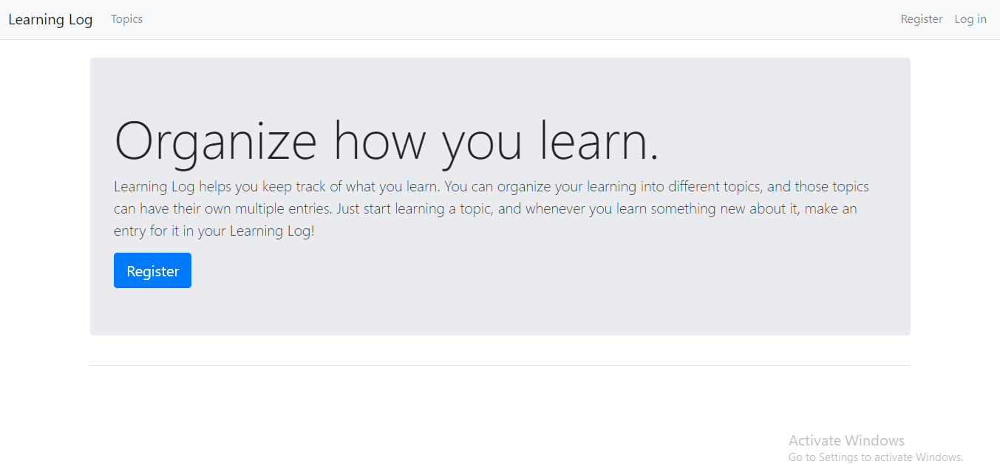

# Learning Log





 Online journal to track what you've learned - built in Python and Django. 

Learning log aids learning by letting you organize what you learn into topics - every time you learn something new about a topic, add a new entry under the topic to track how your learning progresses over time!


Features:


- Users registering and login/logout functionality
- Adding and deleting topics
- Adding and deleting entries
- Modifying entries

 


## How to run


This app depends on Django and Django-Bootstrap4 - install both using:


```
pip install django django-bootstrap4
```


Run the app by navigating to the root directory of this app and executing the following code:


```
python manage.py runserver
```


The app will most probably start at http://localhost:8000


------


This app was built as part of my completion of the [Python Crash Course](https://ehmatthes.github.io/pcc_2e/) by Eric Matthes, coupled with new features I added myself!